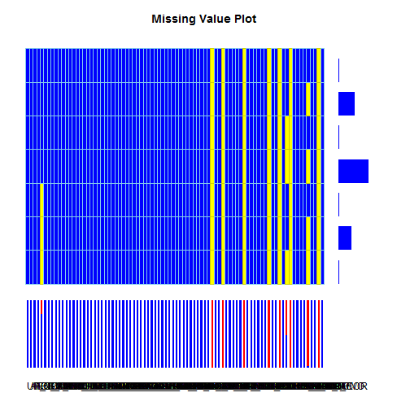

# Relatório de qualidade de dados e análise exploratória gráfoca para o banco de dados do SUS

Elias Carvalho ecacarva@gmail.com
Adelia Batilana adeliabatilana@gmail.com
Ricardo Pietrobon, MD, PhD rpietro@duke.edu


## Introduction
O principal objetivo deste relatório é fornecer informações sobre o banco de dados SUS
The main objective of this report is to provide ....
Detalhes metodológicos sobre este projeto podem ser encontrados em no site [Big Data Analises]

Abaixo está uma lista completa das variáveis, juntamente com a sua classe (tipo variável de acordo com a linguagem R) e respostas alternativas. A maioria dos nomes das variáveis devem ser intuitivos, mas um dicionário de dados é descrito a seguir:


```
## sus 
## 
##  84  Variables      5000  Observations
## ---------------------------------------------------------------------------
## UF_ZI : Municipio Gestor 
##       n missing  unique    Mean     .05     .10     .25     .50     .75 
##    5000       0     591  326819  150120  211104  260790  330170  410000 
##     .90     .95 
##  431440  520000 
## 
## lowest : 110000 110002 110003 110004 110006
## highest: 522020 522045 522060 522160 530000 
## ---------------------------------------------------------------------------
## ANO_CMPT : Ano Competencia 
##       n missing  unique    Mean 
##    5000       0       1    2009 
## ---------------------------------------------------------------------------
## MES_CMPT : Mes Competencia 
##       n missing  unique    Mean     .05     .10     .25     .50     .75 
##    5000       0      12   6.655       1       2       4       7       9 
##     .90     .95 
##      11      12 
## 
##             1   2   3   4   5   6   7   8   9  10  11  12
## Frequency 344 369 417 387 419 450 462 457 452 434 408 401
## %           7   7   8   8   8   9   9   9   9   9   8   8
## ---------------------------------------------------------------------------
## ESPEC : Especialidade 
##       n missing  unique    Mean     .05     .10     .25     .50     .75 
##    5000       0      12   2.917       1       1       1       3       3 
##     .90     .95 
##       7       7 
## 
##              1   2    3  4   5 6   7 8  9 10 12 14
## Frequency 1362 998 1686 55 246 3 612 6 11  4  3 14
## %           27  20   34  1   5 0  12 0  0  0  0  0
## ---------------------------------------------------------------------------
## CGC_HOSP : CGC Hospital 
##         n   missing    unique      Mean       .05       .10       .25 
##      3957      1043      1720 3.506e+13 1.049e+12 3.390e+12 8.667e+12 
##       .50       .75       .90       .95 
## 2.717e+13 5.599e+13 8.334e+13 8.942e+13 
## 
## lowest : 1.508e+10 2.983e+10 3.817e+10 5.402e+10 5.402e+10
## highest: 9.811e+13 9.831e+13 9.842e+13 9.859e+13 9.871e+13 
## ---------------------------------------------------------------------------
## N_AIH : Numero do AIH 
##         n   missing    unique      Mean       .05       .10       .25 
##      5000         0      5000  3.27e+12 1.509e+12 2.109e+12 2.609e+12 
##       .50       .75       .90       .95 
## 3.309e+12 4.108e+12 4.309e+12 5.209e+12 
## 
## lowest : 1.109e+12 1.109e+12 1.109e+12 1.109e+12 1.109e+12
## highest: 5.310e+12 5.310e+12 5.310e+12 5.310e+12 9.909e+12 
## ---------------------------------------------------------------------------
## IDENT : Identificacao do tipo de AIH 
##       n missing  unique    Mean 
##    5000       0       2   1.138 
## 
## 1 (4827, 97%), 5 (173, 3%) 
## ---------------------------------------------------------------------------
## CEP : CEP do Paciente 
##        n  missing   unique     Mean      .05      .10      .25      .50 
##     5000        0     3842 50788162  6814911 12222701 26535090 55540000 
##      .75      .90      .95 
## 72173273 88134702 94080762 
## 
## lowest :  1126000  1213000  1222001  1307003  1313000
## highest: 99810000 99820000 99835000 99900000 99980000 
## ---------------------------------------------------------------------------
## MUNIC_RES : Municipio do Paciente 
##       n missing  unique    Mean     .05     .10     .25     .50     .75 
##    5000       0    1891  327246  150220  211018  261160  330283  410018 
##     .90     .95 
##  431560  520025 
## 
## lowest : 110002 110003 110004 110006 110009
## highest: 530140 530150 530160 530170 530180 
## ---------------------------------------------------------------------------
## NASC : Data Nascimento do Paciente 
##        n  missing   unique     Mean      .05      .10      .25      .50 
##     5000        0     4570 19722488 19300415 19370595 19540983 19760765 
##      .75      .90      .95 
## 19891109 20050802 20080512 
## 
## lowest : 19000928 19100610 19100912 19110415 19111118
## highest: 20091122 20091124 20091129 20091201 20091211 
## ---------------------------------------------------------------------------
## SEXO : Sexo do Paciente 
##       n missing  unique    Mean 
##    5000       0       2   2.196 
## 
## 1 (2011, 40%), 3 (2989, 60%) 
## ---------------------------------------------------------------------------
## UTI_MES_IN : Dias de UTI no mes inicial da internacao 
##       n missing  unique    Mean 
##    5000       0       1       0 
## ---------------------------------------------------------------------------
## UTI_MES_AN : Dias de UTI no mes anterior a alta 
##       n missing  unique    Mean 
##    5000       0       1       0 
## ---------------------------------------------------------------------------
## UTI_MES_AL : Dias de UTI no mes da alta 
##       n missing  unique    Mean 
##    5000       0       1       0 
## ---------------------------------------------------------------------------
## UTI_MES_TO : Quantidade de atod-UTI 
##       n missing  unique    Mean     .05     .10     .25     .50     .75 
##    5000       0      30  0.2956       0       0       0       0       0 
##     .90     .95 
##       0       0 
## 
## lowest :  0  1  2  3  4, highest: 34 37 54 59 71 
## ---------------------------------------------------------------------------
## MARCA_UTI : Marca de UTI-Depende do ato 
##       n missing  unique    Mean     .05     .10     .25     .50     .75 
##    5000       0      10   3.412       0       0       0       0       0 
##     .90     .95 
##       0       0 
## 
##              0 74  75 76 77 78 79 80 81 82
## Frequency 4776 13 125 41  1 11  2  1 24  6
## %           96  0   2  1  0  0  0  0  0  0
## ---------------------------------------------------------------------------
## UTI_INT_IN : Dias em UTI no mes inicial - ato 34 ou 56 
##       n missing  unique    Mean 
##    5000       0       1       0 
## ---------------------------------------------------------------------------
## UTI_INT_AN : Dias em UTI no mes anterior a alta - ato 34 ou 56 
##       n missing  unique    Mean 
##    5000       0       1       0 
## ---------------------------------------------------------------------------
## UTI_INT_AL : Dias em UTI no mes da alta - ato 34 ou 56 
##       n missing  unique    Mean 
##    5000       0       1       0 
## ---------------------------------------------------------------------------
## UTI_INT_TO : Totaliza dias em UTI - ato 34 ou 56 
##       n missing  unique    Mean 
##    5000       0       8   0.011 
## 
##              0 1 2 3 5 6 13 19
## Frequency 4990 1 4 1 1 1  1  1
## %          100 0 0 0 0 0  0  0
## ---------------------------------------------------------------------------
## DIAR_ACOM : Qtde de diarias de acompanhante 
##       n missing  unique    Mean     .05     .10     .25     .50     .75 
##    5000       0      40   1.306       0       0       0       0       1 
##     .90     .95 
##       4       6 
## 
## lowest :  0  1  2  3  4, highest: 45 46 50 57 72 
## ---------------------------------------------------------------------------
## PROC_SOLIC : Codigo de procedimento solicitado 
##         n   missing    unique      Mean       .05       .10       .25 
##      5000         0       535 339765966 303010061 303030045 303090226 
##       .50       .75       .90       .95 
## 304100013 407040064 411010034 411020013 
## 
## lowest : 201010321 209040050 211050091 211050105 301050074
## highest: 505010100 505020050 506020010 506020037 506020045 
## ---------------------------------------------------------------------------
## PROC_REA : Codigo de procedimento realizado 
##         n   missing    unique      Mean       .05       .10       .25 
##      5000         0       535 340090457 303010061 303030038 303080092 
##       .50       .75       .90       .95 
## 304100013 407040064 411010034 411020013 
## 
## lowest : 201010321 201010402 209040050 211050091 211050105
## highest: 505010100 505020050 506020010 506020037 506020045 
## ---------------------------------------------------------------------------
## VAL_SH : Valor dos servicos hospitalares 
##       n missing  unique    Mean     .05     .10     .25     .50     .75 
##    5000       0    2329   720.3   101.2   139.9   253.4   356.7   561.1 
##     .90     .95 
##  1160.2  2020.3 
## 
## lowest :     0.00    20.40    24.48    29.14    30.47
## highest: 29286.88 30044.38 38179.82 50271.77 52193.27 
## ---------------------------------------------------------------------------
## VAL_SP : Valor dos sercvicos prestados por terceiros 
##       n missing  unique    Mean     .05     .10     .25     .50     .75 
##    5000       0    1381   167.8   23.99   26.77   41.95   84.32  227.74 
##     .90     .95 
##  304.89  441.99 
## 
## lowest :    0.00    2.63    2.75    3.00    3.05
## highest: 3409.56 3690.60 4296.82 4886.46 5708.94 
## ---------------------------------------------------------------------------
## VAL_SADT : Valor de SADT 
##       n missing  unique    Mean 
##    5000       0       1       0 
## ---------------------------------------------------------------------------
## VAL_RN : Valor de recem-nato 
##       n missing  unique    Mean 
##    5000       0       1       0 
## ---------------------------------------------------------------------------
## VAL_ACOMP : Valor de acompanhante 
##       n missing  unique    Mean 
##    5000       0       1       0 
## ---------------------------------------------------------------------------
## VAL_ORTP : Valor de ortese e protese 
##       n missing  unique    Mean 
##    5000       0       1       0 
## ---------------------------------------------------------------------------
## VAL_SANGUE : Valor de sangue 
##       n missing  unique    Mean 
##    5000       0       1       0 
## ---------------------------------------------------------------------------
## VAL_SADTSR : Valor de SADT sem rateio 
##       n missing  unique    Mean 
##    5000       0       1       0 
## ---------------------------------------------------------------------------
## VAL_TRANSP : Valor de transplante 
##       n missing  unique    Mean 
##    5000       0       1       0 
## ---------------------------------------------------------------------------
## VAL_OBSANG : Valor de anestesia 
##       n missing  unique    Mean 
##    5000       0       1       0 
## ---------------------------------------------------------------------------
## VAL_PED1AC : Valor de pediatria 
##       n missing  unique    Mean 
##    5000       0       1       0 
## ---------------------------------------------------------------------------
## VAL_TOT : Valor total 
##       n missing  unique    Mean     .05     .10     .25     .50     .75 
##    5000       0    2517   888.1   139.4   189.0   324.9   525.4   723.5 
##     .90     .95 
##  1323.6  2372.7 
## 
## lowest :    23.45    28.14    31.77    40.38    41.40
## highest: 31827.36 34930.84 38969.01 50776.84 57902.21 
## ---------------------------------------------------------------------------
## VAL_UTI : Valor de UTI 
##       n missing  unique    Mean     .05     .10     .25     .50     .75 
##    5000       0      83   151.5       0       0       0       0       0 
##     .90     .95 
##       0       0 
## 
## lowest :     0.0   139.0   152.9   278.0   329.3
## highest: 20034.4 21616.8 25850.9 30009.2 33989.1 
## ---------------------------------------------------------------------------
## US_TOT : Valor total em dolar 
##       n missing  unique    Mean     .05     .10     .25     .50     .75 
##    5000       0    3685   464.3   73.01   96.57  168.17  275.32  384.71 
##     .90     .95 
##  701.67 1261.06 
## 
## lowest :    13.25    16.17    16.29    17.04    17.71
## highest: 17073.53 17731.39 22395.98 29015.34 30963.75 
## ---------------------------------------------------------------------------
## DT_INTER : Data internacao 
##        n  missing   unique     Mean      .05      .10      .25      .50 
##     5000        0      458 20089889 20081216 20090111 20090310 20090609 
##      .75      .90      .95 
## 20090903 20091031 20091125 
## 
## lowest : 19980801 20060902 20080101 20080201 20080207
## highest: 20091225 20091226 20091227 20091228 20091230 
## ---------------------------------------------------------------------------
## DT_SAIDA : Data saida 
##        n  missing   unique     Mean      .05      .10      .25      .50 
##     5000        0      432 20090178 20090101 20090123 20090321 20090620 
##      .75      .90      .95 
## 20090911 20091108 20091130 
## 
## lowest : 20081001 20081003 20081006 20081008 20081009
## highest: 20091227 20091228 20091229 20091230 20091231 
## ---------------------------------------------------------------------------
## DIAG_PRINC : Diagnositco principal 
##       n missing  unique 
##    5000       0    1225 
## 
## lowest : A000 A009 A020 A029 A040, highest: Z523 Z524 Z525 Z929 Z988 
## ---------------------------------------------------------------------------
## DIAG_SECUN : Diagnostico secundario 
##       n missing  unique 
##    5000       0     282 
## 
## lowest :      A09  A419 A509 B005, highest: Z380 Z383 Z511 Z523 Z940 
## ---------------------------------------------------------------------------
## COBRANCA : Motivo de cobranca 
##       n missing  unique    Mean     .05     .10     .25     .50     .75 
##    5000       0      20   14.42      11      12      12      12      12 
##     .90     .95 
##      21      31 
## 
## lowest : 11 12 13 14 15, highest: 31 41 42 43 51 
## ---------------------------------------------------------------------------
## NATUREZA : Natureza juridica do hospital 
##       n missing  unique    Mean 
##    5000       0       9   47.12 
## 
##           0  20 22  30  40   50  60   61 80
## Frequency 3 713 40 206 983 1011 294 1749  1
## %         0  14  1   4  20   20   6   35  0
## ---------------------------------------------------------------------------
## GESTAO : orgao emissor do gestor 
##       n missing  unique    Mean 
##    5000       0       2   1.447 
## 
## 1 (2766, 55%), 2 (2234, 45%) 
## ---------------------------------------------------------------------------
## RUBRICA : Numero da rubrica 
##       n missing  unique    Mean 
##    5000       0       1       0 
## ---------------------------------------------------------------------------
## IND_VDRL : Exame VDRL 
##       n missing  unique     Sum    Mean 
##    5000       0       2     958  0.1916 
## ---------------------------------------------------------------------------
## MUNIC_MOV : Municipio do hospital 
##       n missing  unique    Mean     .05     .10     .25     .50     .75 
##    5000       0    1352  327617  150180  211130  261160  330350  410040 
##     .90     .95 
##  431519  520110 
## 
## lowest : 110002 110003 110004 110006 110009
## highest: 530110 530120 530140 530170 530180 
## ---------------------------------------------------------------------------
## COD_IDADE : Codigo da Idade 
##       n missing  unique    Mean 
##    5000       0       4   3.935 
## 
## 2 (94, 2%), 3 (140, 3%), 4 (4765, 95%), 5 (1, 0%) 
## ---------------------------------------------------------------------------
## IDADE : Idade 
##       n missing  unique    Mean     .05     .10     .25     .50     .75 
##    5000       0      99   36.46       2       5      19      32      54 
##     .90     .95 
##      71      79 
## 
## lowest :  0  1  2  3  4, highest: 94 95 96 97 98 
## ---------------------------------------------------------------------------
## DIAS_PERM : Dias de permanencia 
##       n missing  unique    Mean     .05     .10     .25     .50     .75 
##    5000       0      65   5.871       1       1       2       3       5 
##     .90     .95 
##      14      29 
## 
## lowest :   0   1   2   3   4, highest:  77  85  94 130 182 
## ---------------------------------------------------------------------------
## MORTE : Obito 
##       n missing  unique     Sum    Mean 
##    5000       0       2     153  0.0306 
## ---------------------------------------------------------------------------
## NACIONAL : Nacionalidade 
##       n missing  unique    Mean 
##    5000       0       5   10.04 
## 
##             10 30 39 50 140
## Frequency 4996  1  1  1   1
## %          100  0  0  0   0
## ---------------------------------------------------------------------------
## NUM_PROC : Numero do processamento 
##       n missing  unique 
##       0    5000       0 
## ---------------------------------------------------------------------------
## CAR_INT : Carater de internacao 
##       n missing  unique    Mean 
##    5000       0       4   1.847 
## 
## 1 (1000, 20%), 2 (3937, 79%), 5 (15, 0%), 6 (48, 1%) 
## ---------------------------------------------------------------------------
## TOT_PT_SP : Total de pontos em SP 
##       n missing  unique    Mean 
##    5000       0       1       0 
## ---------------------------------------------------------------------------
## CPF_AUT : CPF do auditor que autorizou o homonimo 
##       n missing  unique 
##       0    5000       0 
## ---------------------------------------------------------------------------
## HOMONIMO : Marca de homonimo 
##       n missing  unique    Mean 
##    5000       0       3  0.1568 
## 
## 0 (4605, 92%), 1 (6, 0%), 2 (389, 8%) 
## ---------------------------------------------------------------------------
## NUM_FILHOS : Qtde de filhos do paciente 
##       n missing  unique    Mean 
##    5000       0       5  0.0166 
## 
##              0  2  3 4 5
## Frequency 4970 14 10 5 1
## %           99  0  0 0 0
## ---------------------------------------------------------------------------
## INSTRU : Grau de instrucao 
##       n missing  unique    Mean 
##    5000       0       3  0.0142 
## 
## 0 (4970, 99%), 2 (19, 0%), 3 (11, 0%) 
## ---------------------------------------------------------------------------
## CID_NOTIF : Cid de notificacao 
##       n missing  unique 
##    5000       0       2 
## 
##  (4970, 99%), Z302 (30, 1%) 
## ---------------------------------------------------------------------------
## CONTRACEP1 : Metodo contraceptivo1 
##       n missing  unique    Mean 
##    5000       0       6  0.0358 
## 
##              0 1 8 10 11 12
## Frequency 4980 1 8  8  2  1
## %          100 0 0  0  0  0
## ---------------------------------------------------------------------------
## CONTRACEP2 : Metodo contraceptivo2 
##       n missing  unique 
##       0    5000       0 
## ---------------------------------------------------------------------------
## GESTRISCO : Gestante de alto risco 
##       n missing  unique     Sum    Mean 
##    5000       0       2    4997  0.9994 
## ---------------------------------------------------------------------------
## INSC_PN : Numero da gestante no pre-natal 
##         n   missing    unique      Mean       .05       .10       .25 
##      5000         0       272 154566786  0.00e+00  0.00e+00  0.00e+00 
##       .50       .75       .90       .95 
##  0.00e+00  0.00e+00  0.00e+00  2.32e+08 
## 
## lowest : 0.000e+00 1.000e+00 4.100e+01 1.235e+04 1.702e+04
## highest: 5.309e+09 5.309e+09 5.309e+09 5.309e+09 1.000e+10 
## ---------------------------------------------------------------------------
## SEQ_AIH5 : Sequencial da AIH tipo 5 - Longa permanencia 
##       n missing  unique    Mean 
##    5000       0       4  0.0034 
## 
## 0 (4997, 100%), 1 (1, 0%), 2 (1, 0%), 14 (1, 0%) 
## ---------------------------------------------------------------------------
## CBOR : Codigo CBO 
##       n missing  unique    Mean 
##    5000       0       2   50.42 
## 
## 0 (4999, 100%), 252105 (1, 0%) 
## ---------------------------------------------------------------------------
## CNAER : Codigo de acidente de trabalho 
##       n missing  unique    Mean 
##    5000       0       2  0.0722 
## 
## 0 (4999, 100%), 361 (1, 0%) 
## ---------------------------------------------------------------------------
## VINCPREV : Vinculo com a previdencia 
##       n missing  unique     Sum    Mean 
##    5000       0       2       1   2e-04 
## ---------------------------------------------------------------------------
## GESTOR_COD : Codigo da autorizacao pagamento 
##       n missing  unique 
##       0    5000       0 
## ---------------------------------------------------------------------------
## GESTOR_TP : Tipo de Gesstor??? 
##       n missing  unique     Sum    Mean 
##    5000       0       2     596  0.1192 
## ---------------------------------------------------------------------------
## GESTOR_CPF : CPF do Gestor 
##       n missing  unique    Mean     .05     .10     .25     .50     .75 
##    5000       0     278  335706       0       0       0       0       0 
##     .90     .95 
##  542899 3012850 
## 
## lowest :       0    6127   20131   25133   28199
## highest: 9236041 9309979 9429533 9665557 9753579 
## ---------------------------------------------------------------------------
## GESTOR_DT : Gestor_DT??? 
##       n missing  unique 
##       0    5000       0 
## ---------------------------------------------------------------------------
## CNES : Codigo do CNES 
##       n missing  unique    Mean     .05     .10     .25     .50     .75 
##    5000       0    2263 2259988   10499 2003775 2082853 2328054 2602008 
##     .90     .95 
## 2775999 3126838 
## 
## lowest :      35      94     396     418     426
## highest: 6164366 6187412 8001448 8013659 8015899 
## ---------------------------------------------------------------------------
## CNPJ_MANT : CNPJ_MANT??? 
##         n   missing    unique      Mean       .05       .10       .25 
##      2430      2570       712  2.81e+13 5.450e+11 3.435e+12 7.273e+12 
##       .50       .75       .90       .95 
## 1.693e+13 4.637e+13 7.567e+13 8.351e+13 
## 
## lowest : 6.874e+09 3.817e+10 9.786e+10 1.760e+11 3.071e+11
## highest: 9.296e+13 9.296e+13 9.511e+13 9.544e+13 9.600e+13 
## ---------------------------------------------------------------------------
## INFEHOSP : INFEHOSP??? 
##       n missing  unique 
##       0    5000       0 
## ---------------------------------------------------------------------------
## CID_ASSO : CID Causa 
##       n missing  unique 
##    5000       0      55 
## 
## lowest :      A09  A418 A419 C929, highest: W189 X099 X588 X959 Z392 
## ---------------------------------------------------------------------------
## CID_MORTE : CID Morte 
##       n missing  unique 
##    5000       0      79 
## 
## lowest :      A319 A400 A415 A419, highest: S720 S724 W799 Z039 Z525 
## ---------------------------------------------------------------------------
## COMPLEX : COMPLEX??? 
##       n missing  unique    Mean 
##    5000       0       2   2.043 
## 
## 2 (4784, 96%), 3 (216, 4%) 
## ---------------------------------------------------------------------------
## FINANC : FINANC??? 
##       n missing  unique    Mean 
##    5000       0       2   5.964 
## 
## 4 (91, 2%), 6 (4909, 98%) 
## ---------------------------------------------------------------------------
## FAEC_TP : FAEC_TP??? 
##       n missing  unique    Mean 
##      91    4909       6   40040 
## 
##           40023 40024 40028 40032 40041 40043
## Frequency     1     1     1    21     1    66
## %             1     1     1    23     1    73
## ---------------------------------------------------------------------------
## REGCT : REGCT??? 
##       n missing  unique    Mean 
##    5000       0       7    1320 
## 
##              0 7102 7104 7106 7109 7110 7112
## Frequency 4071  660   32   64  133   35    5
## %           81   13    1    1    3    1    0
## ---------------------------------------------------------------------------
## RACA_COR : RACA_COR??? 
##       n missing  unique    Mean 
##    5000       0       6   35.73 
## 
##              1   2    3  4  5   99
## Frequency 1693 160 1360 34 12 1741
## %           34   3   27  1  0   35
## ---------------------------------------------------------------------------
## ETNIA : ETNIA??? 
##       n missing  unique 
##       0    5000       0 
## ---------------------------------------------------------------------------
## ARQUIVO : ARQUIVO??? 
##       n missing  unique 
##    5000       0     304 
## 
## lowest : RDAC0901.dbf RDAC0902.dbf RDAC0903.dbf RDAC0904.dbf RDAC0905.dbf
## highest: RDSP0908.dbf RDSP0909.dbf RDSP0910.dbf RDSP0911.dbf RDSP0912.dbf 
## ---------------------------------------------------------------------------
```


Uma descrição de valores missing (representados em amarelo) são fornecidos na Figura abaixo


```r
library(vmv)
tablemissing(sus)
```

 

```
##       UF_ZI ANO_CMPT MES_CMPT ESPEC CGC_HOSP N_AIH IDENT CEP MUNIC_RES
## 1         1        1        1     1        1     1     1   1         1
## 2         1        1        1     1        1     1     1   1         1
## 3         1        1        1     1        1     1     1   1         1
## 4         1        1        1     1        1     1     1   1         1
## 5         1        1        1     1        0     1     1   1         1
## 6         1        1        1     1        0     1     1   1         1
## 7         1        1        1     1        0     1     1   1         1
## Total     0        0        0     0     1043     0     0   0         0
##       NASC SEXO UTI_MES_IN UTI_MES_AN UTI_MES_AL UTI_MES_TO MARCA_UTI
## 1        1    1          1          1          1          1         1
## 2        1    1          1          1          1          1         1
## 3        1    1          1          1          1          1         1
## 4        1    1          1          1          1          1         1
## 5        1    1          1          1          1          1         1
## 6        1    1          1          1          1          1         1
## 7        1    1          1          1          1          1         1
## Total    0    0          0          0          0          0         0
##       UTI_INT_IN UTI_INT_AN UTI_INT_AL UTI_INT_TO DIAR_ACOM PROC_SOLIC
## 1              1          1          1          1         1          1
## 2              1          1          1          1         1          1
## 3              1          1          1          1         1          1
## 4              1          1          1          1         1          1
## 5              1          1          1          1         1          1
## 6              1          1          1          1         1          1
## 7              1          1          1          1         1          1
## Total          0          0          0          0         0          0
##       PROC_REA VAL_SH VAL_SP VAL_SADT VAL_RN VAL_ACOMP VAL_ORTP VAL_SANGUE
## 1            1      1      1        1      1         1        1          1
## 2            1      1      1        1      1         1        1          1
## 3            1      1      1        1      1         1        1          1
## 4            1      1      1        1      1         1        1          1
## 5            1      1      1        1      1         1        1          1
## 6            1      1      1        1      1         1        1          1
## 7            1      1      1        1      1         1        1          1
## Total        0      0      0        0      0         0        0          0
##       VAL_SADTSR VAL_TRANSP VAL_OBSANG VAL_PED1AC VAL_TOT VAL_UTI US_TOT
## 1              1          1          1          1       1       1      1
## 2              1          1          1          1       1       1      1
## 3              1          1          1          1       1       1      1
## 4              1          1          1          1       1       1      1
## 5              1          1          1          1       1       1      1
## 6              1          1          1          1       1       1      1
## 7              1          1          1          1       1       1      1
## Total          0          0          0          0       0       0      0
##       DT_INTER DT_SAIDA DIAG_PRINC DIAG_SECUN COBRANCA NATUREZA GESTAO
## 1            1        1          1          1        1        1      1
## 2            1        1          1          1        1        1      1
## 3            1        1          1          1        1        1      1
## 4            1        1          1          1        1        1      1
## 5            1        1          1          1        1        1      1
## 6            1        1          1          1        1        1      1
## 7            1        1          1          1        1        1      1
## Total        0        0          0          0        0        0      0
##       RUBRICA IND_VDRL MUNIC_MOV COD_IDADE IDADE DIAS_PERM MORTE NACIONAL
## 1           1        1         1         1     1         1     1        1
## 2           1        1         1         1     1         1     1        1
## 3           1        1         1         1     1         1     1        1
## 4           1        1         1         1     1         1     1        1
## 5           1        1         1         1     1         1     1        1
## 6           1        1         1         1     1         1     1        1
## 7           1        1         1         1     1         1     1        1
## Total       0        0         0         0     0         0     0        0
##       NUM_PROC CAR_INT TOT_PT_SP CPF_AUT HOMONIMO NUM_FILHOS INSTRU
## 1            0       1         1       0        1          1      1
## 2            0       1         1       0        1          1      1
## 3            0       1         1       0        1          1      1
## 4            0       1         1       0        1          1      1
## 5            0       1         1       0        1          1      1
## 6            0       1         1       0        1          1      1
## 7            0       1         1       0        1          1      1
## Total     5000       0         0    5000        0          0      0
##       CID_NOTIF CONTRACEP1 CONTRACEP2 GESTRISCO INSC_PN SEQ_AIH5 CBOR
## 1             1          1          0         1       1        1    1
## 2             1          1          0         1       1        1    1
## 3             1          1          0         1       1        1    1
## 4             1          1          0         1       1        1    1
## 5             1          1          0         1       1        1    1
## 6             1          1          0         1       1        1    1
## 7             1          1          0         1       1        1    1
## Total         0          0       5000         0       0        0    0
##       CNAER VINCPREV GESTOR_COD GESTOR_TP GESTOR_CPF GESTOR_DT CNES
## 1         1        1          0         1          1         0    1
## 2         1        1          0         1          1         0    1
## 3         1        1          0         1          1         0    1
## 4         1        1          0         1          1         0    1
## 5         1        1          0         1          1         0    1
## 6         1        1          0         1          1         0    1
## 7         1        1          0         1          1         0    1
## Total     0        0       5000         0          0      5000    0
##       CNPJ_MANT INFEHOSP CID_ASSO CID_MORTE COMPLEX FINANC FAEC_TP REGCT
## 1             1        0        1         1       1      1       1     1
## 2             1        0        1         1       1      1       0     1
## 3             0        0        1         1       1      1       1     1
## 4             0        0        1         1       1      1       0     1
## 5             1        0        1         1       1      1       1     1
## 6             1        0        1         1       1      1       0     1
## 7             0        0        1         1       1      1       0     1
## Total      2570     5000        0         0       0      0    4909     0
##       RACA_COR ETNIA ARQUIVO Total
## 1            1     0       1    30
## 2            1     0       1  1360
## 3            1     0       1    48
## 4            1     0       1  2519
## 5            1     0       1    13
## 6            1     0       1  1027
## 7            1     0       1     3
## Total        0  5000       0  5000
```

Abaixo se encontra uma aplicação do MINE (maximal Information-based Nonparametric Exploration) algoritmo do Science article (Detecting Novel Association in Large Data Sets)[http://www.sciencemag.org/content/334/6062/1518.abstract?ijkey=cRCIlh2G7AjiA&keytype=ref&siteid=sci]. Veja também (http://www.exploredata.net/)[http://www.exploredata.net/]


```r
source("http://www.exploredata.net/ftp/MINE.r")
# MINE('/Users/rpietro/Google
# Drive/R/nonpublicdata_publications/HPV/hpv.csv','all.pairs')
MINE("c:/sus/sus5000rand.csv", "all.pairs")
```

```
## Error: class not found
```

